# Shuttle

## About
Android App/Widget that suggest you apps, based on you usage, based on time, location and more

**Available for Android on Google Play Store** [Download now](https://play.google.com/store/apps/details?id=studio.forface.shuttle).

### Screenshots
#### Phone
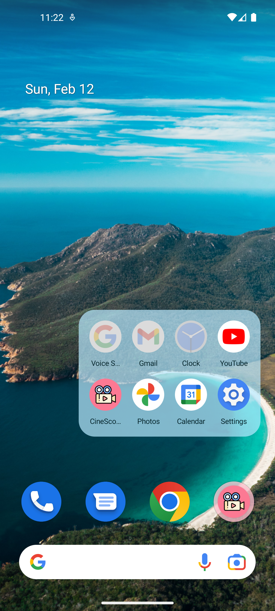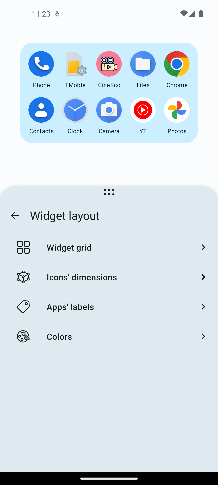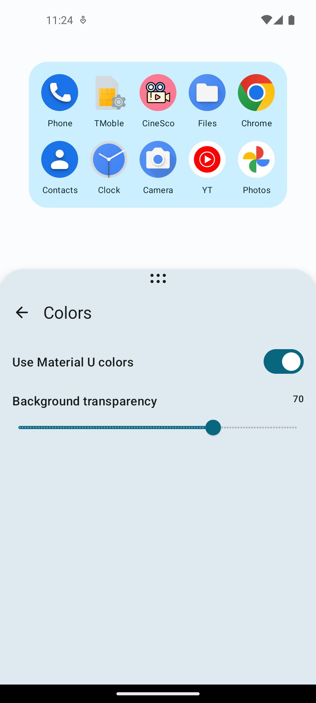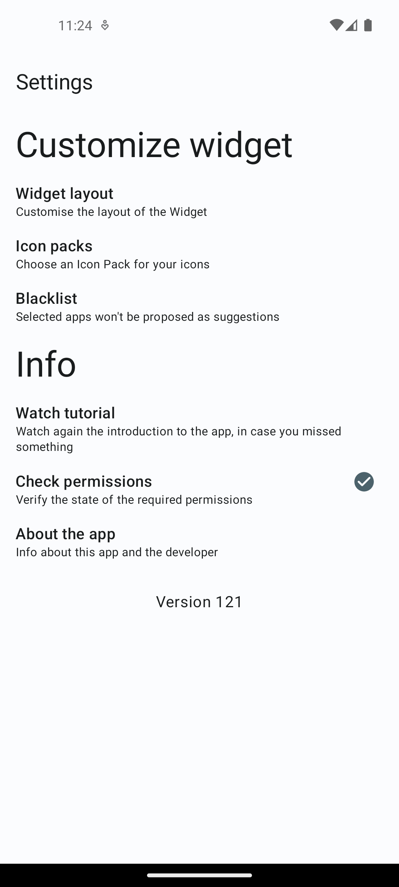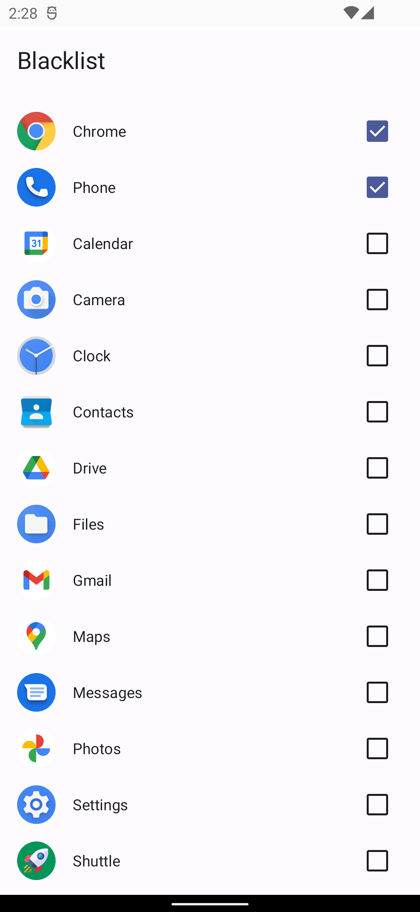
#### Tablet
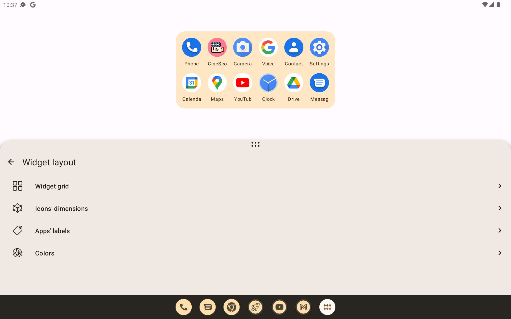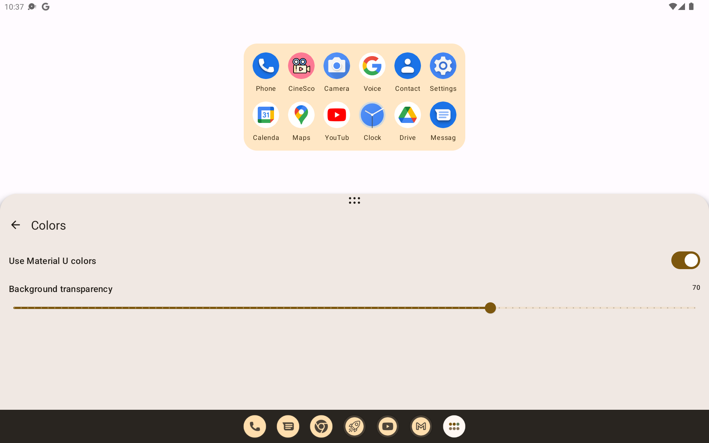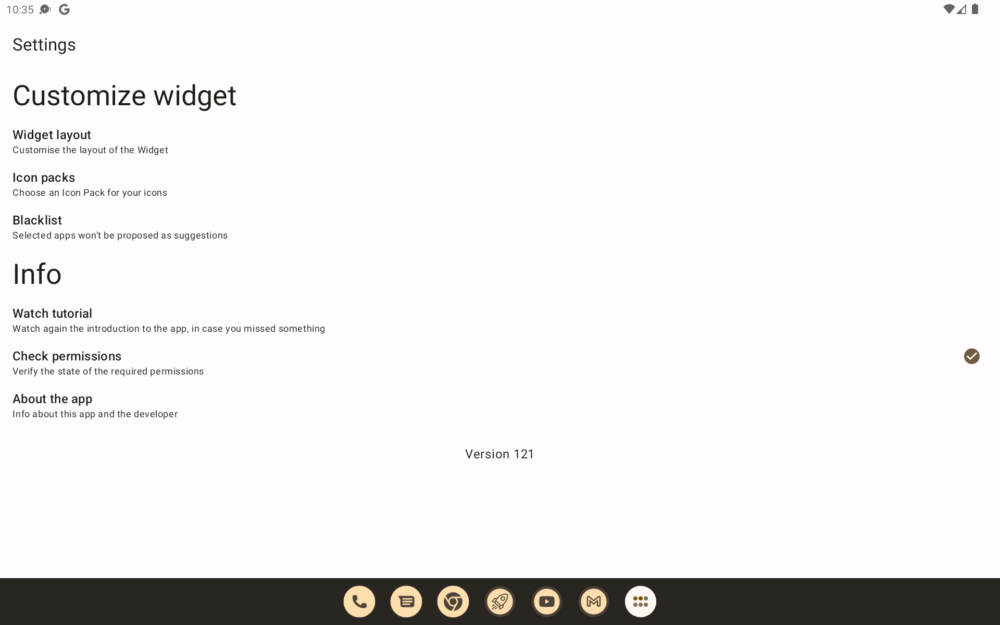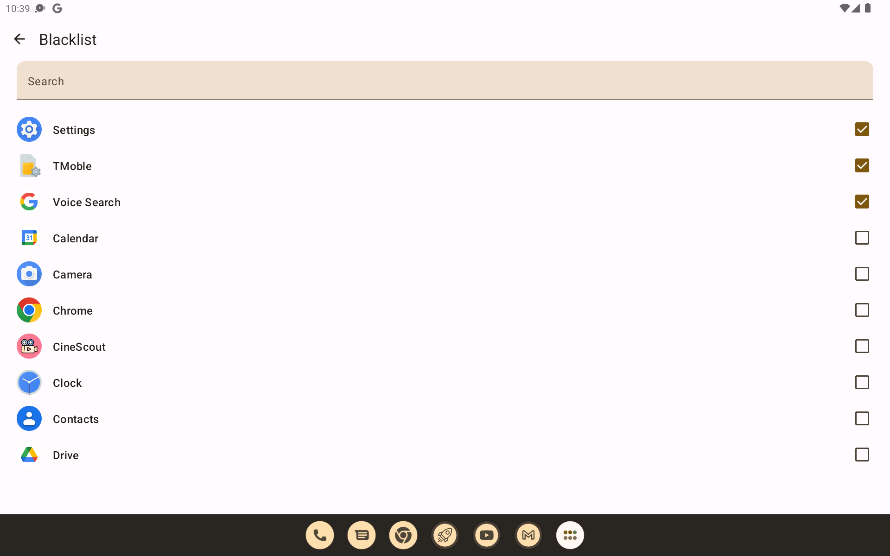
#### Foldable
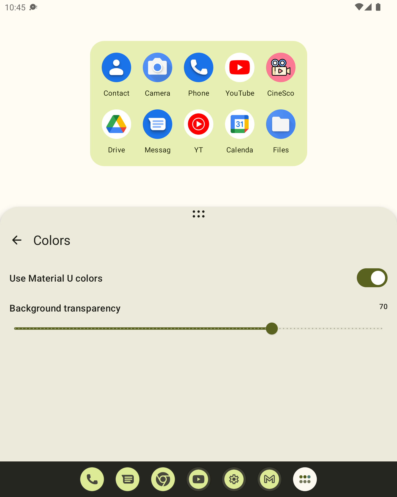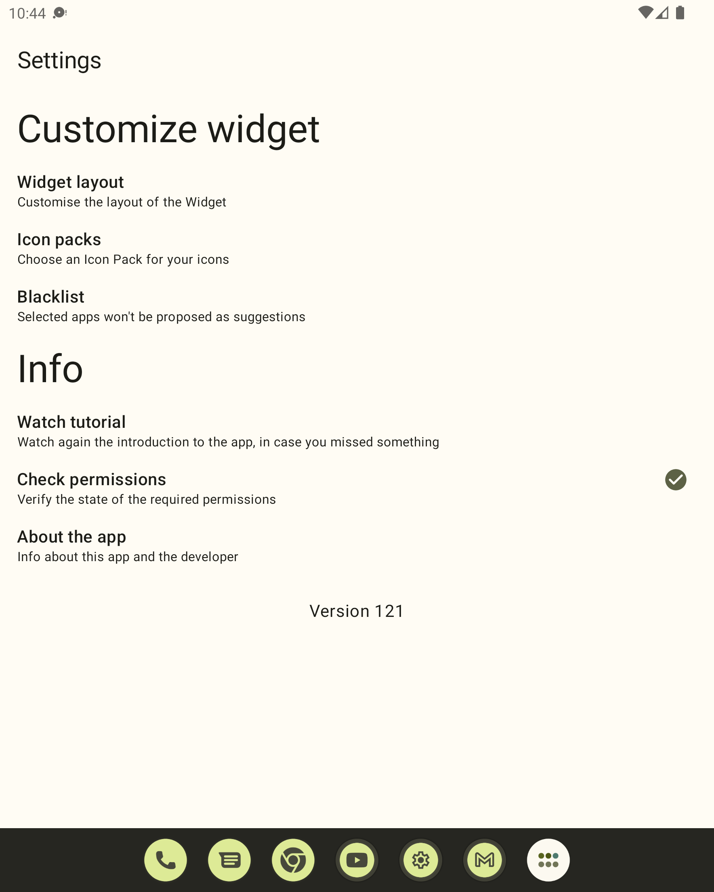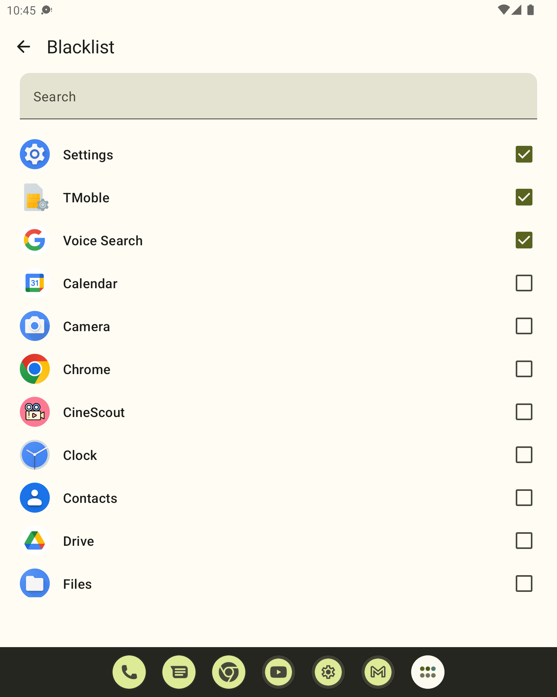

### Features:
- Icon pack support
- Blacklist
- Customizable Widget

### Upcoming features:
- Wear OS tile

### Tech stack:
- Android Adaptive UI level 3
- Clean Architecture
- Compose Glance Widget
- Composite builds
- Continuous Delivery
- Detekt
- Jetpack Compose
- Kotlin Jvm
- Koin
- Material 3
- SQLDelight
- Test Driven Development

## Setup
- Have a JDK >= 11 installed (even the bundled one with AS/IJ)
- Run `./scripts/tuner.sh` to setup the local tools used by this repository
